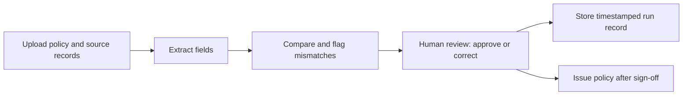

# Checking Agent

AI-assisted verification of insurance policy documents against their source records, with a human reviewer approving every result.

Developed as the capstone MVP for the Advanced Programme in Management (APM06), IIM Kozhikode, Group 13.

## Problem

Underwriting, audit and compliance teams check issued policy documents against source records largely by hand, or with a checklist. The work is slow, and errors in fields such as the named insured, policy number, dates, premium, limits and endorsements still reach issued documents. General-purpose AI tools can speed up the check, but practitioners are reluctant to rely on them without review, and their outputs are not always consistent from one run to the next.

## What the Checking Agent does

1. The checker uploads the issued policy and its source records.
2. The Checking Agent extracts the key fields from each document.
3. It compares the extracted values field by field and flags any mismatches.
4. A human reviewer approves or corrects each flagged item.
5. The run is stored as a timestamped record for audit purposes.
6. The policy is issued only after human sign-off.



### Fields checked

Named insured, policy number, dates, premium, limits, and waiver of subrogation / endorsements.

## Architecture

| Component | Role | Implementation |
|---|---|---|
| Web front end | Document upload and review interface | Static HTML/JavaScript served by the Flask app |
| Application service | API and orchestration | Python 3.11, Flask, served by Gunicorn in a Docker container `[confirm hosting, e.g. Cloud Run]` |
| Document parser | Extracts text from policy PDFs | `pdfplumber` |
| Comparison engine | Field-level comparison and discrepancy flagging | Application logic in `main.py`, with model calls to Gemini |
| Language model | Field extraction and interpretation | Gemini 3.1 Flash-Lite on Vertex AI, via the `google-genai` SDK (set through `GEMINI_MODEL`) |
| Run record store | Timestamped results for audit | Cloud Firestore |

All components run within a single Google Cloud project.

## Getting started

### Prerequisites

- A Google Cloud project with the Vertex AI API enabled
- Python 3.11
- Cloud Firestore enabled in the same project
- Google Cloud CLI (`gcloud`), authenticated to your project

### Setup

```bash
git clone https://github.com/<your-username>/checking-agent.git
cd checking-agent
cp .env.example .env    # add your project ID and region
pip install -r requirements.txt
gunicorn --bind 0.0.0.0:8080 --workers 1 --timeout 300 main:app
```

Credentials are read from environment variables and are never committed to this repository. See `.env.example` for the required variables.

The sample PDFs used in `tests/` are not included in this repository because they were supplied by an insurer. To run `tests/selftest.py`, place your own policy and binder PDFs in `tests/` using the same file names.

### Deploy to Cloud Run

```bash
gcloud run deploy checking-agent --source . --region <your-region>
```

Set the environment variables below on the Cloud Run service rather than in the image.

### Configuration

| Variable | Purpose |
|---|---|
| `GEMINI_MODEL` | Model name on Vertex AI. The deployed service sets `gemini-3.1-flash-lite`; the code falls back to `gemini-3.7-flash` if unset. |
| `MAX_OUTPUT_TOKENS` | Maximum output tokens per model call. Defaults to `8192`. |
| `TEST_USERS` | Comma-separated `username:password` pairs for the demo login. |
| `SESSION_SECRET_KEY` | A long random string. Keeps sessions valid across redeploys. |

The demo login is intended for evaluation only. It has no MFA, password rotation or lockout, and must not be used with real client data.

## Evaluation

The MVP was benchmarked against a general-purpose AI assistant on a test set of policy document pairs containing injected discrepancies. The evaluation measured precision, recall, F1 and consistency across repeated runs, and used McNemar's test for the paired comparison. A practitioner survey of underwriting, audit and compliance professionals examined current checking practice and attitudes towards AI-assisted checking. Full results are reported in the project report.

## Limitations

- This is a prototype built for academic evaluation. It is not intended for production use.
- It has been tested only on sample and synthetic documents. Do not upload real customer policy documents or personal data.
- Every result requires human review. The tool is designed to assist the checker, not replace them.

## Team

IIM Kozhikode APM06, Group 13.
